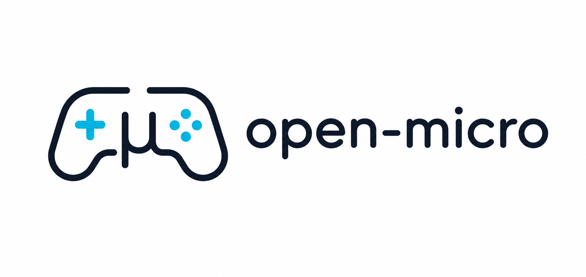

  
  
  

# OpenMicro

Codex Micro, replicated 100% in software with a consumer gamepad. Wrap Claude Code or Codex CLI (`openmicro claude` / `openmicro codex`) and drive it with a DualSense: face buttons accept/reject/push-to-talk/new-chat, left-stick flicks launch workflow presets, right-stick rotation is the thinking-depth dial, the lightbar and player LEDs show live agent status, and the touchpad cycles between sessions. Harness-agnostic — add any other agent CLI via the public `openmicro/harness` API.

_(Full docs land with the initial release — see PLAN.md meanwhile.)_

## Demo GIFs

<!-- demo-gif-plan: capture after v1 works on real hardware. One GIF per feature, ~10s each,
     terminal + controller in frame (overhead phone shot or picture-in-picture), recorded with
     vhs/asciinema for terminal + camera composite. Keep each under 5 MB for GitHub README. -->

Planned captures, one per Codex Micro feature replicated:

| GIF                            | What it shows                                                                                                                                      | Placeholder                                |
| ------------------------------ | -------------------------------------------------------------------------------------------------------------------------------------------------- | ------------------------------------------ |
| `docs/demo/status-leds.gif`    | Agent runs → lightbar turns blue (executing), amber (waiting for input), green flash (complete), red (error); player LEDs light per active session |        |
| `docs/demo/command-keys.gif`   | Permission prompt appears → ✕ accepts, ○ rejects, △ push-to-talk, □ new chat                                                                       |     |
| `docs/demo/workflow-flick.gif` | Left-stick flick up → "review this PR" prompt template lands in the agent and submits                                                              |  |
| `docs/demo/thinking-dial.gif`  | Right-stick clockwise rotation → thinking depth steps up (with on-screen confirmation of the mode change)                                          |        |
| `docs/demo/layers.gif`         | Hold L1 + face button → layer switches, lightbar flashes the layer tint, same button now does a different action                                   |             |
| `docs/demo/multi-session.gif`  | Two terminal tabs both wrapped → touchpad click cycles focus, LEDs show both slots, lightbar tracks the focused session's state                    |    |

Capture checklist: DualSense over Bluetooth (proves wireless), macOS Terminal with a real Claude Code session, controller visible in frame for every clip, no cuts within a clip.
