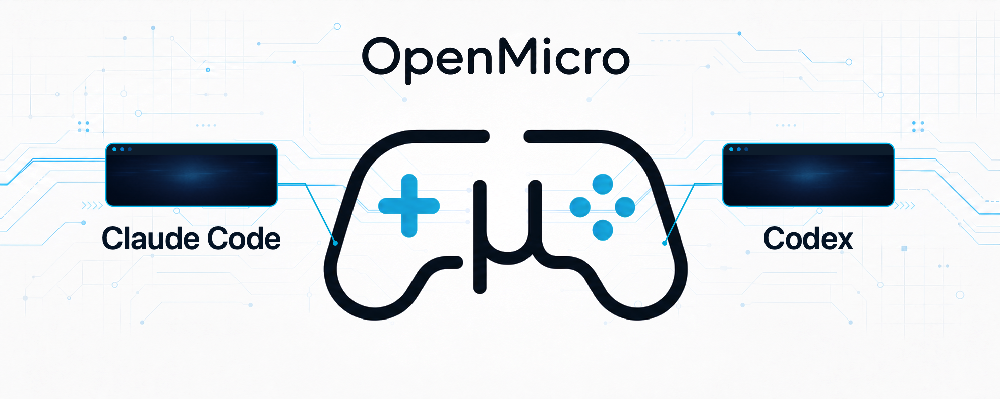
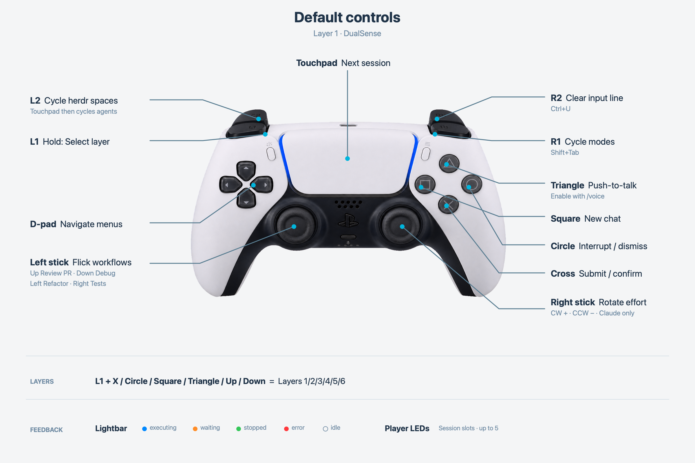
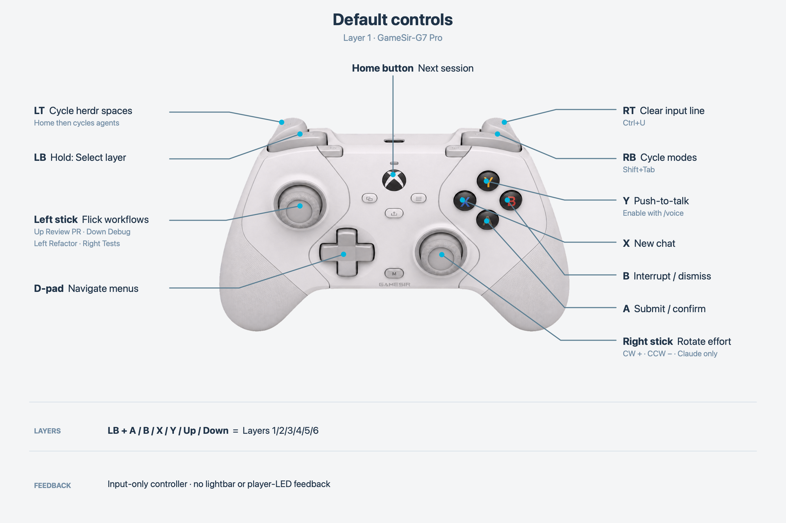
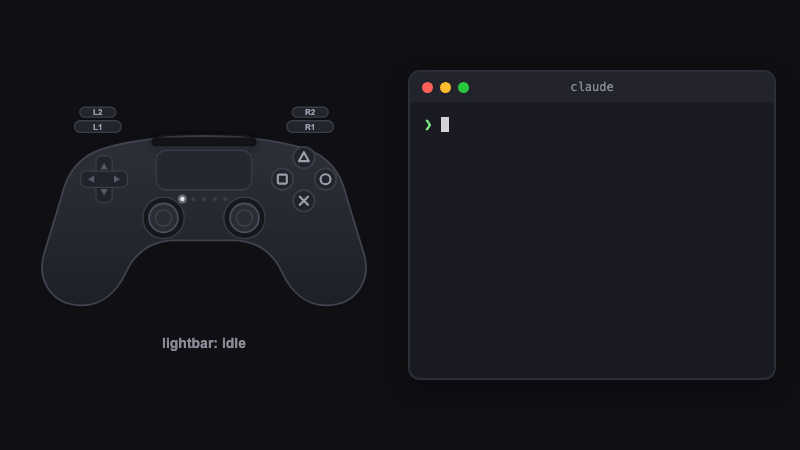
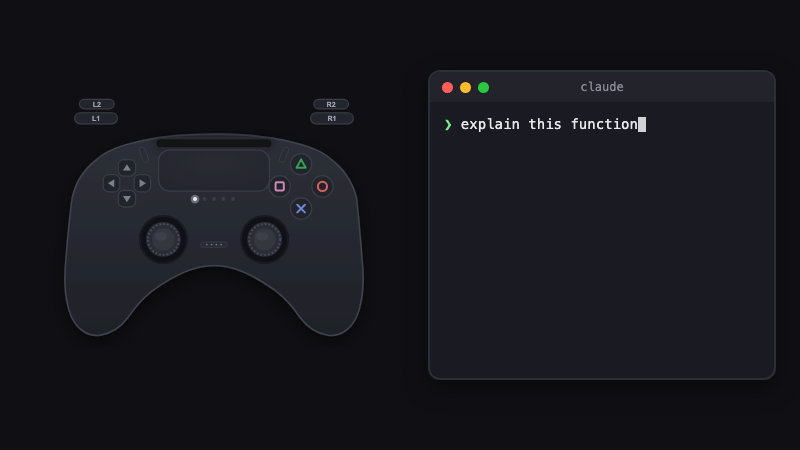
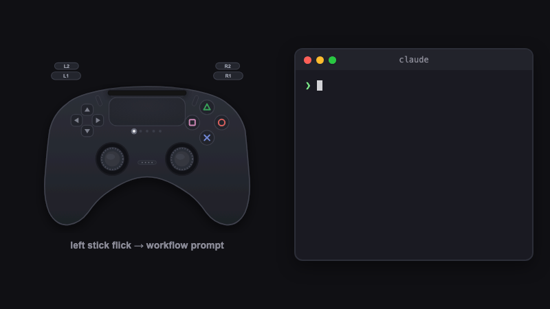
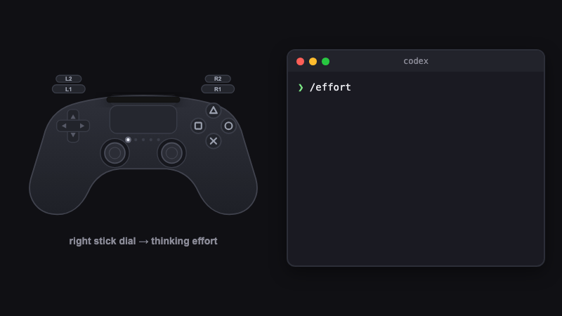
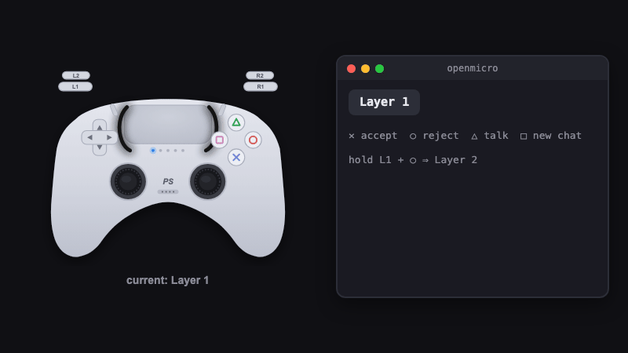
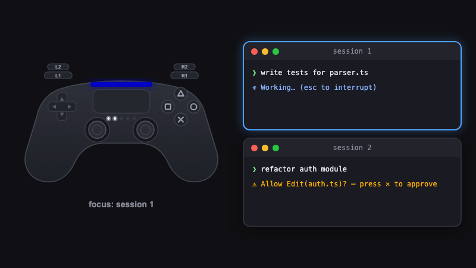

<p align="center"></p>

# One controller. Your agent workflow.

Bring Codex Micro to any gaming controller and coding harness

## Start in 60 seconds

You need macOS, Node.js 22 or newer, Claude Code or Codex CLI, and a connected controller. OpenMicro is macOS-first; other platforms are not yet tested.

```sh
npm i -g openmicro

openmicro claude # or just: openmicro
openmicro codex
openmicro codex-app # drive the Codex macOS desktop app
```

`openmicro codex-app` drives the Codex desktop app instead of a terminal CLI: new chat and prompt prefill use `codex://` deep links (no permission needed), while submit (Enter), reject (Esc), dictation (Ctrl+Shift+D), d-pad arrows, and Ctrl+U send keystrokes and need Accessibility permission for your terminal. A stick-flick prompt prefills the composer; press submit to send it. The app launches automatically and the terminal shows live status (controller, actions, agent state).

The thinking-depth dial (right-stick flicks) needs one-time setup: the app ships "Increase reasoning effort" and "Decrease reasoning effort" shortcuts unassigned, and assignments are account-synced so OpenMicro cannot set them for you. In the Codex app open Settings → Keyboard shortcuts, search "effort", and assign Increase to `⌃⌥=` (Control+Option+`=`, Ctrl+Alt on Windows) and Decrease to `⌃⌥-` — right-stick flicks then step the composer's reasoning effort. These chords avoid the app's Ctrl/Cmd `+`/`-` zoom shortcuts. Optionally also assign "Open model picker" to `⌃⇧M` — right-stick click then opens the picker so you can watch the effort change. Assigned different chords? Remap `thinking_depth` in your OpenMicro config to matching `keys` bindings.

OpenMicro installs its lifecycle hooks automatically. If Codex reports that its hooks changed, open `/hooks` in Codex and trust the OpenMicro hooks.

Controller support depends on the exact device and connection. Check the [controller compatibility guide](CONTROLLERS.md) before you start, or run `openmicro doctor` to test your controller.

## Default controls

|                                   DualSense                                    |                                      GameSir G7 Pro                                      |
| :----------------------------------------------------------------------------: | :--------------------------------------------------------------------------------------: |
|  |  |

### Text control reference

| Control                                   | Action                                                       |
| ----------------------------------------- | ------------------------------------------------------------ |
| south (✕ / A)                             | Submit or confirm                                            |
| east (○ / B)                              | Interrupt or dismiss                                         |
| north (△ / Y)                             | Push-to-talk                                                 |
| west (□ / X)                              | Start a new chat                                             |
| d-pad                                     | Navigate TUI menus; repeats while held                       |
| left stick flick up / down / left / right | Review PR / debug / refactor / write tests                   |
| right stick flick right / left            | Increase / decrease thinking depth                           |
| R1                                        | Cycle modes (Shift+Tab)                                      |
| R2                                        | Clear the input line (Ctrl+U)                                |
| right stick click (R3)                    | Open the model picker (Codex app, with shortcut setup)       |
| touchpad click                            | Focus the next session by default, where supported           |
| L2                                        | Cycle herdr spaces; touchpad then cycles agents in the space |

Stick flicks fire after returning to center. Rotation gestures (`rstick_cw`/`rstick_ccw`, one step per quarter-turn) remain available for remapping. Hold L1 with south, east, west, north, d-pad up, or d-pad down to select one of six layers. The first layer ships with these defaults; the other five start empty. Other controls are unbound by default and remappable.

Voice and thinking-depth support varies by harness; see [OpenMicro feature parity](#openmicro-feature-parity).

## See it in action

Animated demos (rendered, not filmed) of the six core interactions:

|                                                                                                                                            |                                                                                                                              |
| :----------------------------------------------------------------------------------------------------------------------------------------: | :--------------------------------------------------------------------------------------------------------------------------: |
| <br>**Status lightbar** — executing, waiting, done, error | <br>**Command keys** — ✕ ○ △ □ |
|        <br>**Workflow flick** — stick up = review PR         | <br>**Thinking dial** — stick flicks step `/effort`  |
|                 <br>**Layers** — hold L1 to switch                 | <br>**Multi-session** — touchpad switches focus |

## What it gives you

- Respond to agents without hunting through terminal tabs.
- Launch review, debug, refactor, and test workflows with a stick flick.
- Switch among active sessions from one controller.
- See focused-session state on DualSense.
- Remap six layers for project-specific workflows.
- First-class [herdr](#herdr-integration) support: sessions appear in the herdr workspace overview, and the controller drives herdr spaces and agents.

## OpenMicro feature parity

`✅` supported · `⚠️` setup required or best-effort · `—` no verified equivalent

| Capability                       | Claude Code                    | Codex CLI                    |
| -------------------------------- | ------------------------------ | ---------------------------- |
| Launch and forward CLI arguments | ✅ `openmicro claude`          | ✅ `openmicro codex`         |
| Submit / confirm                 | ✅ Enter                       | ✅ Enter                     |
| Interrupt / dismiss              | ✅ Escape                      | ✅ Escape                    |
| Start a new chat                 | ✅ `/clear`                    | ✅ `/new`                    |
| D-pad TUI navigation             | ✅ Arrow-key passthrough       | ✅ Arrow-key passthrough     |
| Stick-triggered workflow prompts | ✅ Supported                   | ✅ Supported                 |
| Push-to-talk                     | ✅ Enable with `/voice`        | — No equivalent              |
| Thinking-depth dial              | ✅ `/effort`, low → max        | — No deterministic binding   |
| Six remappable control layers    | ✅ Supported                   | ✅ Supported                 |
| Multi-session focus switching    | ✅ Supported                   | ✅ Supported                 |
| Executing status                 | ✅ Prompt and tool hooks       | ✅ Prompt and tool hooks     |
| Waiting-for-input status         | ✅ Questions and notifications | ✅ Permission requests       |
| Stop status                      | ✅ Stop hook                   | ✅ Stop hook                 |
| Error status                     | ⚠️ Notification-text matching  | — No error hook signal       |
| Hook installation                | ✅ Automatic                   | ⚠️ Trust changes in `/hooks` |

Layers, workflows, navigation, and session switching are handled by OpenMicro itself. Harness-specific gaps are left unmapped instead of sending guessed keystrokes. A Stop event means the agent stopped; it does not guarantee success.

## Configure controls and workflows

OpenMicro creates `~/.openmicro/config.json` on first run. Edit bindings, layer colors, and workflow prompt text there. Invalid configuration stops startup without overwriting the file.

```json
{
  "layers": [
    {
      "name": "Layer 1",
      "color": { "r": 255, "g": 255, "b": 255 },
      "bindings": {
        "south": { "type": "accept" },
        "lstick_up": { "type": "workflow", "presetId": "review-pr" },
        "rstick_right": { "type": "thinking_depth", "delta": 1 }
      }
    },
    { "name": "Layer 2", "color": { "r": 160, "g": 32, "b": 240 }, "bindings": {} },
    { "name": "Layer 3", "color": { "r": 0, "g": 255, "b": 255 }, "bindings": {} },
    { "name": "Layer 4", "color": { "r": 255, "g": 140, "b": 0 }, "bindings": {} },
    { "name": "Layer 5", "color": { "r": 255, "g": 20, "b": 147 }, "bindings": {} },
    { "name": "Layer 6", "color": { "r": 255, "g": 255, "b": 0 }, "bindings": {} }
  ],
  "workflows": {
    "review-pr": "Review this PR for correctness, security, and style issues."
  }
}
```

Binding keys can be buttons such as `south` and `dpad_up`, or gestures such as `lstick_up` and `rstick_cw`. Actions include `accept`, `reject`, `push_to_talk`, `new_chat`, `thinking_depth`, `workflow`, `prompt`, `focus_session`, `layer`, `herdr_space`, and raw `keys`.

## Sessions and status

The first OpenMicro process owns the controller and becomes the host. Later processes register as clients, so one controller can drive several terminal sessions. On supported pads, touchpad click cycles focus by default.

On DualSense, the lightbar follows the focused session: blue while executing, amber while waiting, green when stopped, red on a detected error, and dim white while idle. The five player LEDs show occupied session slots.

## Herdr integration

OpenMicro treats [herdr](https://github.com/stephenleo/herdr) as a first-class environment. Everything below is automatic and a no-op outside herdr or when the `herdr` CLI is absent.

- **State reporting.** A wrapped session running inside a herdr-managed pane reports its state (working/blocked/idle) to herdr, so it shows up in the herdr agents panel. OpenMicro claims the pane at startup and releases it on exit.
- **Space switching.** L2 cycles through herdr workspaces ("spaces") and back to local mode.
- **Agent cycling.** While a space is selected, the touchpad cycles focus across that space's agents instead of local sessions.
- **Focus follows herdr.** Voice and keystrokes retarget to the agent focused in herdr — switching spaces or agents never spills input into a session in another space.

## Controller compatibility

See [CONTROLLERS.md](CONTROLLERS.md) for the full list of community-tested controllers, connection-specific notes, and per-device status.

## Test or contribute a controller

```sh
openmicro doctor
```

The diagnostic checks controller input and, on DualSense, lightbar/player-LED output. It writes a `<vid>-<pid>-<transport>.json` report that can be added unchanged to `test/fixtures/controllers/`; CI then replays the captured inputs as a regression test. See [CONTROLLERS.md](CONTROLLERS.md) for contribution steps.

## Hardware notes

- DualSense is the only controller with lightbar and player-LED output. DS4, Xbox, and GameSir controllers are input-only; generic HID input is best-effort because report layouts vary.
- DualSense has five player LEDs, so feedback represents at most five active session slots.

## Add another harness

The public `openmicro/harness` API exposes the `Harness` contract and `registerHarness()`. Implement the contract, return `null` for actions without a verified CLI equivalent, and register it before OpenMicro resolves the harness.

```ts
import { registerHarness } from 'openmicro/harness'
import type { Harness } from 'openmicro/harness'

const myHarness: Harness = {
  kind: 'my-cli',
  command: 'my-cli',
  buildArgs: (args) => args,
  installHooks: () => ({ changed: false, trustNotice: null }),
  stateForHookEvent: () => null,
  resolveAction: (action) => {
    if (action.type === 'accept') return { bytes: '\r' }
    if (action.type === 'reject') return { bytes: '\x1b' }
    if (action.type === 'prompt') return { bytes: `${action.text}\r` }
    if (action.type === 'keys') return { bytes: action.bytes }
    return null
  },
}

registerHarness(myHarness)
```

The binary does not load harness plugins from configuration yet, so a third-party registration currently needs a small custom entry point.

## Troubleshooting

### Controller is connected but OpenMicro cannot open it

Another process probably owns the device exclusively. Quit other controller tools, Steam, browser tabs using Gamepad/WebHID, and PS Remote Play, then retry.

On macOS, this command lists processes with the DualSense open:

```sh
ioreg -r -n "DualSense Wireless Controller" -l -w0 | grep IOUserClientCreator
```

Current macOS versions do not require Input Monitoring permission for game controllers.
